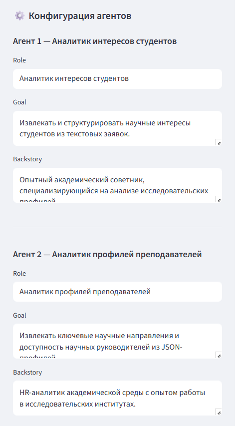
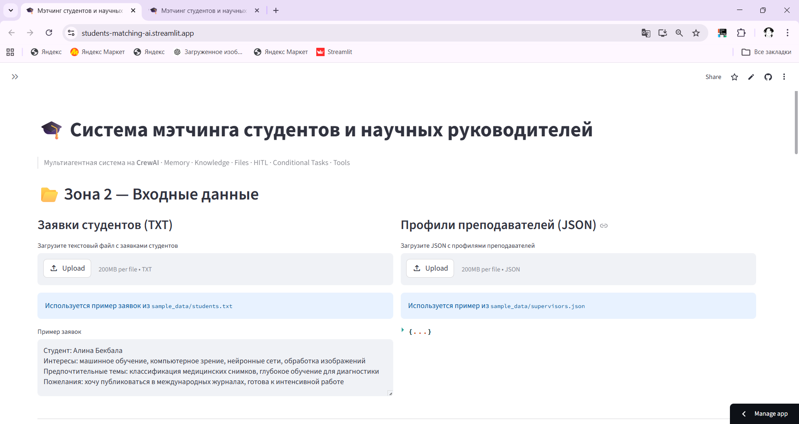
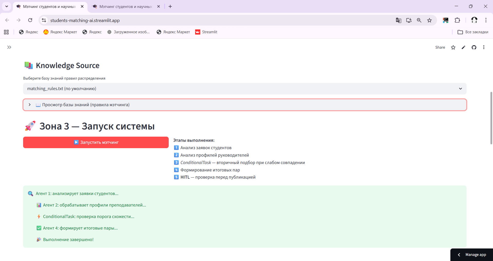
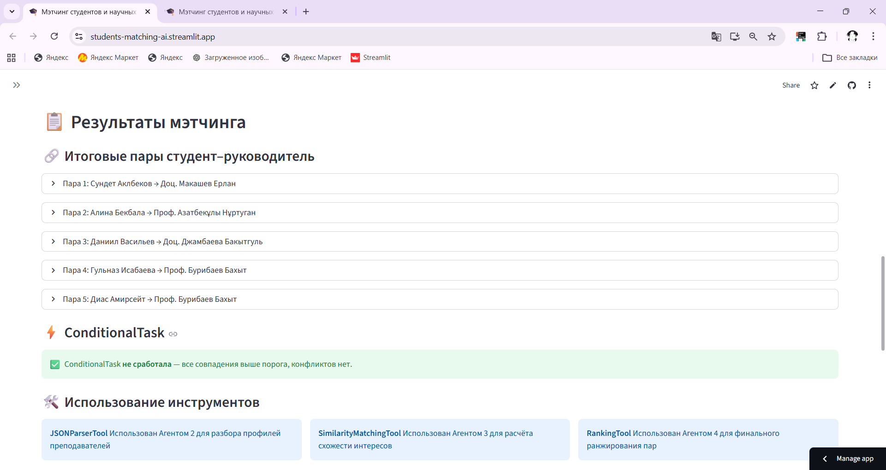
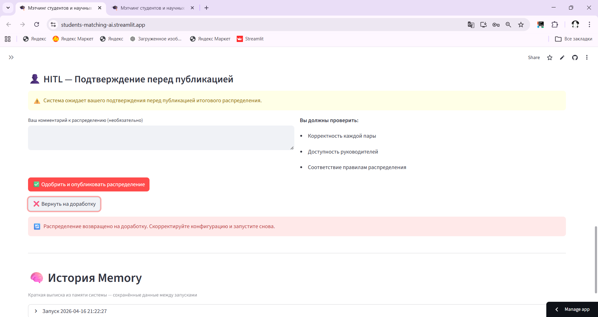
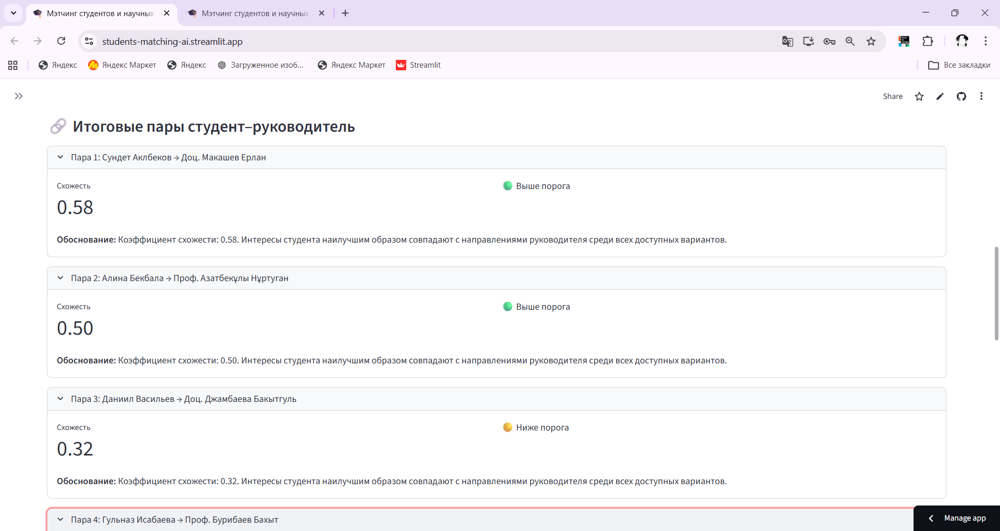

# Student Matching AI

Мультиагентная система мэтчинга студентов и научных руководителей на базе **CrewAI**.

## Возможности

- 4 агента CrewAI: аналитик интересов, аналитик профилей, координатор подбора, составитель пар
- 3 кастомных инструмента: JSONParserTool, SimilarityMatchingTool, RankingTool
- ConditionalTask — вторичный подбор при слабом совпадении
- Knowledge Source — правила распределения из файла
- HITL — подтверждение результата перед публикацией
- Streamlit UI

## Запуск

```bash
pip install -r requirements.txt
streamlit run app.py
```

Для работы нужен OpenAI API Key — вводится в боковой панели.

## Структура

```
app.py                     # Streamlit-приложение
tools.py                   # Кастомные инструменты CrewAI
requirements.txt           # Зависимости
sample_data/
  students.txt             # Пример заявок студентов
  supervisors.json          # Пример профилей преподавателей
knowledge/
  matching_rules.txt        # Правила мэтчинга (Knowledge Source)
```

## Как это работает

1. **Агент 1** анализирует текстовые заявки студентов, извлекает интересы и темы
2. **Агент 2** парсит JSON-профили преподавателей через JSONParserTool
3. **Агент 3** (ConditionalTask) проверяет схожесть через SimilarityMatchingTool — запускается только при слабых совпадениях
4. **Агент 4** формирует финальные пары через RankingTool с учётом доступности мест
5. **HITL** — человек подтверждает распределение

## Скриншоты интерфейса Streamlit

| Описание | Скриншот |
|---|---|
| Зона 1 — Конфигурация агентов |  |
| Зона 2 — Входные данные |  |
| Зона 3 — Запуск системы (Knowledge Source) |  |
| Результаты мэтчинга |  |
| HITL — подтверждение результата |  |
| Итоговые пары студент–руководитель |  |

## Автор

**Гульназ Исабаева** — isabaewa.g.05@gmail.com